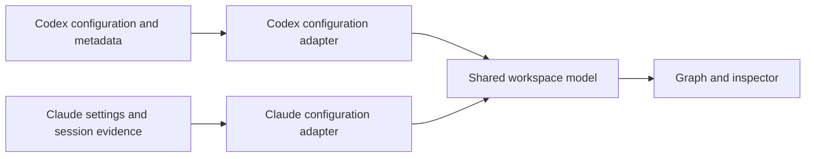
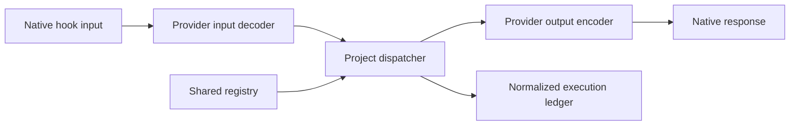

# Codex and Claude Code provider adapters

Status: core implementation complete; interactive approval and live SDK session release gates remain open. Scope: configuration inspection, sub-hook management, protocol conversion and recorded execution for the five existing lifecycle events. Adapters, dispatcher, simultaneous agent inspection, per-checkout saves, ledger, usage and typed Claude callback bridge are implemented.

## Decision

Use a shared workspace model with two provider adapters. Separate configuration and status discovery from runtime input and output conversion. Keep provider-specific capabilities explicit; do not translate unsupported behavior into success.





The workspace server reads configuration and saves registry controls. It does not execute hooks. The project dispatcher executes sub-hooks when the agent invokes its registered parent command. The dispatcher entrypoint is `scripts/dispatch-hook.ts`; `pnpm --silent config` previews native registrations without changing settings or trust.

## Baseline couplings

| Area | Previous coupling | Implemented change |
|---|---|---|
| Registry and saves | `.codex/hooks/registry.yaml` in loader and management | Resolve an explicit shared registry location; preserve legacy reads |
| Configuration | Counts commands in project `hooks.json` | Separate provider discovery and configuration-source identity |
| Status | `codex app-server` `hooks/list` | Provider-specific discovery and evidence provenance |
| UI | Codex labels, boolean enablement and four trust values | Separate configured state, approvals, applicability and execution |
| History | Custom JSONL ledger under `.codex/hooks/state` | Shared ledger with provider and invocation identity |
| Usage | Fixed `codex` and `jev` fields | Provider-keyed usage with documented counting rules |
| Events | Five hardcoded event IDs | Capability profile for each provider and tested runtime version |

## Evidence and versions

| Evidence | Version or scope |
|---|---|
| Published Codex TypeScript SDK inspected | `@openai/codex-sdk` `0.160.1` |
| Published Claude TypeScript SDK inspected | `@anthropic-ai/claude-agent-sdk` `0.3.291` |
| Codex CLI used for captures | `0.160.0` |
| Claude Code CLI used for captures | `2.1.285` |
| CLI-generated hook input | All five events for both providers; tool/Stop journey uses scripted loopback responses |
| Codex discovery | Enabled commands with `untrusted` approval |
| Model execution | Prompt-rejection capture: zero model POSTs. Full lifecycle capture: four local scripted requests per CLI, zero remote model calls |

SDK version and CLI version are separate compatibility dimensions. These captures do not certify execution on the latest SDK-bundled runtimes. Record the executable version in every capture. Live hook payloads omit it, so runtime ledger entries store version unknown rather than guessing from an installed SDK. SDK package types are useful contracts, but do not prove runtime behavior.

Observed in captured fixtures:

- Codex discovery returns lower-camel event names; hook stdin uses lifecycle names such as `UserPromptSubmit`.
- Codex can report `enabled: true` and `trustStatus: untrusted` together.
- Codex ephemeral input has a null transcript path and a turn ID. Claude input has a transcript path and prompt ID, with no Codex turn ID.
- Claude emits a blocked-prompt warning and a successful final result with zero turns and zero cost. Codex also reports a zero-token completed turn after the fixture rejects the prompt.
- Codex hook execution in this capture deliberately bypasses per-hook trust for known disposable scripts. Discovery does not bypass trust. This proves input capture, not approval.

Captures use disposable project/config directories, synthetic prompts, a minimal inherited environment and no inherited API keys. The prompt-rejection endpoint rejects model requests; the lifecycle endpoint supplies scripted SSE responses locally. Sanitization removes temporary paths and generated UUIDs. The fixture manifest records transformations and transport. Raw startup inventory and diagnostics are excluded.

## Differences that affect the UI

Documented differences below are compatibility constraints, not promises of equivalent behavior. References: [Codex hooks](https://developers.openai.com/codex/hooks), [Claude hooks](https://code.claude.com/docs/en/hooks), [Claude SDK hooks](https://code.claude.com/docs/en/agent-sdk/hooks), [Codex app-server](https://developers.openai.com/codex/app-server).

| Difference | UI behavior | Adapter boundary |
|---|---|---|
| Codex per-definition trust; Claude workspace trust | Codex: Needs trust / Modified / Trusted. Claude: omit the per-hook trust badge; offer workspace-approval explanation | Never map Claude configuration presence to Codex trust |
| Claude workspace approval depends on session mode | Show Workspace approval unknown until the selected session supplies evidence | Reading settings cannot establish interactive-session approval |
| Claude has no equivalent public SDK hook inventory identified | Show Configured and source; mark active-session status unverified | A missing discovery API is Unsupported; a failed available read is Unknown |
| Codex per-hook enablement; Claude global disable and configuration removal | Keep registry sub-hook switch separate from provider enablement | Do not offer a native individual-command switch when unavailable |
| Matching native handlers run concurrently | Sequential arrows only inside our dispatcher; other commands are separate branches | Native configuration order is not dependency order |
| Tool schemas differ | Show native tool name alongside any shared category | Do not relabel a patch as a Claude Edit payload |
| PostToolUse feedback differs | Display Feedback delivered separately from Result replaced | `block` is not one universal post-tool action |
| Claude separates successful and failed tool events | Include failure-event coverage when showing an after-tool check | A PostToolUse-only registration must not claim to observe failures |
| Stop continuation differs from stopping the agent | Label Keep working / End turn explicitly | Avoid a generic `continue` boolean in the shared result |
| SDK callbacks and command hooks have different timeout behavior | Show transport and timeout policy in details | Fail-open applies to dispatcher-owned failures, not every native host failure |
| Native transcripts differ and may be absent | No transcript available; captured last response remains inspectable | Transcript readers remain provider-specific |
| Usage schemas differ | Provider totals with Unknown or partial markers | Count hook LLM calls only; never substitute the whole agent session |
| CLI success can accompany a policy rejection | Record Prompt rejected independently of Process completed | Parse policy decisions and observations separately |

Codex PreToolUse does not support every field accepted by Claude, including Claude's ask/defer decisions. Codex input rewriting requires `permissionDecision: allow`; Claude can return `updatedInput` without that permission override. Claude SDK callbacks on tool/prompt events can time out with a block, while corresponding command hooks have different defaults. Versioned capability profiles must distinguish supported syntax from supported effects. [Codex output contracts](https://developers.openai.com/codex/hooks#common-output-fields), [Claude callback timeouts](https://code.claude.com/docs/en/agent-sdk/hooks#hook-not-firing).

## Status model and compact presentation

Use independent dimensions. The existing `enabledNow` boolean must not become the overall readiness state.

```ts
type Observation<T> =
  | { kind: 'known'; value: T; source: string; checkedAt: string }
  | { kind: 'unknown'; reason: string }
  | { kind: 'unsupported'; reason: string };

type Approval =
  | { scope: 'command'; state: 'trusted' | 'untrusted' | 'modified' | 'managed' }
  | { scope: 'workspace'; state: 'accepted' | 'required' }
  | { scope: 'none' };

interface HookStatus {
  configured: Observation<boolean>;
  providerEnabled: Observation<boolean>;
  approval: Observation<Approval>;
  subHookEnabled: boolean;
  applicability: Observation<'matches' | 'does-not-match'>;
  execution: Observation<{
    outcome: 'passed' | 'blocked' | 'skipped' | 'failed' | 'cancelled';
    invocationId: string;
    registryRevision?: string;
  }>;
}
```

Do not create `scope: none` because a provider lacks a read API. That means approval is unobservable, not absent. Claude's per-command approval capability is unsupported; its workspace gate remains a separate observation.

Compact entry-row examples:

| Evidence | Row | Hover or focus explanation |
|---|---|---|
| Codex enabled and untrusted | Master hook · Enabled · Needs trust | Review this command in Codex |
| Codex modified | Master hook · Enabled · Modified | Current definition needs renewed approval |
| Codex fully discovered and approved | Master hook · Enabled · Trusted | Configuration permits execution; no run implied |
| Claude project settings only | Master hook · Configured · Session unverified | Workspace approval and active settings have not been observed |
| Claude session records an invocation | Master hook · Configured · Ran | Timestamp and provider/session identity; applies to that recorded run |
| Registry switch disabled | Review · Switched off | Saved sub-hook configuration; next dispatcher invocation |
| Relevant capability unsupported | Input rewrite · Unsupported | This provider/version cannot preserve the requested action |
| Previously healthy read fails | Master hook · Status unavailable | Stale readiness cleared; recorded history retained |

Use a neutral dot for unverified configuration, a warning icon for a known approval requirement, and a success icon only for the stated evidence. Approval, enablement and execution have accessible text; color alone conveys no state. Hide inapplicable controls, but retain an explanation when an existing hook requires the missing capability. Do not add empty placeholder rows.

Use the same component and state rules on desktop/mobile and all lifecycle tabs. Cards size to rendered content, including wrapped explanations. Inspect hover and keyboard-focus text. A historical successful run never promotes current configuration to trusted or enabled.

## Adapter contracts

```ts
interface ProviderAdapter {
  id: 'codex' | 'claude';
  capabilities(version: string, transport: 'command' | 'sdk-callback'): CapabilityProfile;
  inspect(project: string): Promise<ProviderSnapshot>;
  decodeInput(event: unknown): NormalizedHookInput;
  encodeResult(input: NormalizedHookInput, result: HookResult): NativeHookResponse;
}
```

`ProviderSnapshot` includes provider/version, canonical project identity, source layers, discovery completeness, global disable policy and session provenance. Unsupported inspection fields are explicit. Discovering an unmanaged handler permits inspection; it does not grant management authority.

`NormalizedHookInput` retains native input and includes provider, event, canonical project, nullable transcript/turn/prompt/tool IDs and optional native tool category. Preserve permission modes without coercing Claude-only modes into Codex values. A version can add fields without changing existing semantics; unknown decision values fail validation.

`HookResult` separates stage outcome from requested effect:

- No provider action, with optional model context or user warning.
- Reject prompt with reason.
- Deny tool with reason.
- Rewrite tool input with native payload and explicit permission behavior.
- Provide post-tool feedback, with an optional separately validated output replacement.
- Request continuation after Stop with reason.
- End processing only where the provider/transport supports that effect.

Do not use `passed` to auto-approve tools. Omit permission decisions for a normal pass so the host's permission checks still apply. Convert an existing native response only when its event, transport and effect are known; otherwise return a compatibility error to the dispatcher. The dispatcher records the failure and applies the configured error policy. Never silently remove an intended denial or redaction.

## Configuration and dispatcher

1. Inspect both agents together. Discover local sessions by default; repeat `--project` to restrict configuration roots. The native adapter is identified by its registration, independently of execution filters.
2. Introduce a provider-neutral registry, for example `.hooks-workspace/registry.yaml`, with legacy `.codex/hooks/registry.yaml` support. If both exist, require explicit selection; do not silently migrate or overwrite.
3. Keep one registered parent command per managed event per provider. Both parents can consume the same registry, but a shared save explicitly applies to both on their next invocation. Show that scope beside Save settings.
4. Discover external user, project, local, plugin and managed sources where supported. Distinguish project-only coverage from complete discovery. Apply provider precedence and policy; project settings alone cannot prove effective state.
5. Inspect additional native handlers without drawing sequential dependency arrows. Changes to registry order govern only our dispatcher.
6. Save atomically with a revision check, and revalidate event capabilities, prerequisite order, unique positions and finalizer placement. Preserve unrelated provider settings.
7. Validate dependencies against each selected provider. A stage absent on Claude is not a passed prerequisite for a shared dependent stage.
8. Publish a generic dispatcher with decoders/encoders as a separate implementation increment. Refresh registry settings on every invocation. Handle concurrent invocations with separate IDs and scoped state.

Provider trust and installation remain outside registry Save settings. The workspace must not enable hooks, alter approval records, start an agent query or bypass trust as a side effect of inspection.

## Execution and token records

Ledger identity: provider + session + invocation + sub-hook. Keep tool-call and turn/prompt IDs separate and nullable. Persist registry revision, normalized outcome, requested/applied effect names, native decision summary, transport, skip reason and duration. Runtime CLI version is explicitly unknown; capture manifests record exact tested binaries. Prevent duplicate observations when both the dispatcher and an SDK stream describe the same run. A single session-level hook-success envelope cannot prove every sub-hook ran.

Usage records belong to actual hook LLM callers. Store provider-native usage plus a documented normalized total. Codex cached-input and reasoning counts overlap its totals; Claude cache-read/cache-write counts require different accounting. Keep missing usage as unknown and mark partial totals. A rejected prompt with zero agent usage does not show that earlier hook LLM calls were free.

Retain project-path containment for reads and writes, including symlink targets. Resolve filesystem aliases before comparing project identity. Compare encoded argument structures, not command substrings, when discovering dispatcher identity. Preserve unknown native handler types as read-only records.

## Test cases

Fixture-backed checks validate native discovery and execution. `server/adapters.test.ts` exercises both adapters and real local stage processes. Evidence below distinguishes implementation tests, native CLI journeys and remaining acceptance gates.

| ID | Case | Required assertion | Evidence |
|---|---|---|---|
| U01 | Enabled but untrusted Codex command | Provider enabled is true; execution readiness remains false | CLI discovery fixture; implemented |
| U02 | Response for another project | Reject metadata; never display another project's status | CLI fixture mutation; implemented |
| U03 | Unknown trust value | Explicit protocol failure; clear stale readiness | CLI fixture mutation; implemented |
| U04 | Missing transcript and provider IDs | Retain null/absent fields; no fabricated cross-provider IDs | CLI input fixtures; implemented contract check |
| U05 | Successful turn with rejected prompt | Success envelope cannot stand in for policy outcome | CLI turn fixtures; implemented contract check |
| U05a | Malformed Codex configuration | Warnings reject status instead of yielding an empty healthy inventory | CLI invalid-config fixture; implemented |
| U05b | Mixed fixture bundle | Hash mismatch fails before protocol tests are trusted | Fixture manifest; implemented |
| U06 | Trusted, managed, modified, disabled states | Independent enablement/approval; no historical-run promotion | Metadata tests and simulated browser states pass; interactive trust lifecycle pending |
| U07 | Claude settings without session evidence | Configured; per-hook approval unsupported; workspace gate unknown | Settings tests and both browser viewports pass |
| U08 | Global hook disable or managed override | Parent can be disabled while registry stage is enabled | User/project/local file tests pass; managed effective policy stays unknown |
| U09 | Native PreToolUse deny | Tool side-effect sentinel remains absent | Both native CLIs pass with scripted loopback model; denied sentinel absent |
| U10 | Input rewrite | Correct provider-native input executes; requested permission policy preserved | Opt-in/encoding and chained-input process tests pass; native rewritten tool execution pending |
| U11 | Claude ask/defer sent to Codex | Capability error; no claimed equivalent action | Negative codec cases pass; unsupported native permission changes rejected |
| U12 | After-tool feedback | Assert what reaches model; original side effects remain | Both native CLIs pass; original Bash output and side effects retained; feedback reaches next request |
| U13 | Failed tool call | Claude failure event routed once; Codex failed-command event normalized | PostToolUseFailure explicitly outside this five-event release; native failed-tool capture pending |
| U14 | Stop continuation versus end-processing | Continuation observed; explicit termination distinct; loop guard bounded | Both native CLIs continue once; local loop-guard tests pass; native end-processing pending |
| U15 | Timeout by event and transport | Native behavior recorded; dispatcher-owned failures preserve fail-open policy | Dispatcher timeout and active SDK cancellation tests pass; live SDK host timeout pending |
| U16 | Invalid/empty/exit-2 handler output | No false pass; distinguish deliberate denial from malformed output | Local empty/malformed/nonzero/exit-2 process tests pass; native fault journey pending |
| U17 | Ordered prerequisites and advisory/blocking modes | Passed prerequisite only; blocking short-circuit; finalizer policy explicit | Local execution and ledger reconciliation tests pass |
| U18 | Shared registry with provider-limited stage | Reject dependencies with no shared provider; unavailable prerequisites skip dependents | Disjoint provider prerequisite rejected on save; unavailable prerequisite skips dependent |
| U19 | Concurrent save and invocation | Revision conflict preserved; distinct invocation histories | Stale save and concurrent provider invocation tests pass |
| U20 | Parallel unmanaged native handlers | No fabricated sequential graph or suppression guarantee | Command inventory and shared-stage graph scope browser checks pass; host concurrency remains outside dispatcher control |
| U21 | Layered sources and discovery failure | Correct provenance/completeness; stale status cleared | Claude file layering/error recovery and Codex parser tests pass; full Claude live inventory unavailable |
| U22 | Usage with cache counts, missing data, duplicate IDs | Correct totals and unknown/partial markers | Codex/Claude/Jev totals, deduplication and partial usage tests pass; caller normalization is caller-owned |
| U23 | Symlink, traversal and canonical aliases | Containment preserved; same canonical project matched | Source/state/registry containment, canonical roots and subdirectory invocation tests pass |
| B01 | Provider switch during pending fetch | Ignore late response from previous provider/project | Abort/provider identity guards implemented; switch retains unsaved settings in browser; delayed-response injection pending |
| B02 | Capability absent versus read failed | Unsupported and Unknown have distinct text/actions | Claude partial/unsupported approval and read failures verified in browser |
| B03 | Disabled sub-hook behind permitted parent | Parent state unchanged; stage shown switched off | Shared saved-off state persists after reload; provider approval untouched |
| B04 | Every status with short/wrapped content | No overflow or reserved blank rows; accessible focus/hover labels | All five tabs, Codex status cases, Claude unverified state and wrapped content pass at 1440/390px |
| B05 | External config edit and provider outage | Update status, clear stale readiness, preserve history/unsaved controls | Claude settings corruption/replacement recovers; shared settings survive provider switches |

## Fixture capture and release gates

Run `pnpm fixtures:capture` and `pnpm test:native` manually. Normal unit tests use checked-in sanitized JSON and do not launch either agent. Capture only owned disposable scripts; isolate settings, record bypasses and prevent remote model requests. The lifecycle script uses an owned scripted loopback endpoint. Review fixture diffs before committing. Recapture on a supported CLI or SDK-runtime upgrade; do not automatically bless a changed contract by replacing fixtures.

Input and turn-envelope checks validate the capture contract. Adapter/dispatcher tests exercise application code; separate native journeys prove CLI transport and side-effect/continuation assertions. Fixture hashes detect partial or unrelated replacements.

Initial captured coverage is deliberately limited to discovery and two events. Trusted/modified/managed policy transitions, tool events, Stop semantics and SDK callback behavior need separate captures. Settings mutations are synthetic unit inputs unless the manifest records a corresponding real CLI observation.

Release gates:

- Both provider adapters decode the recorded inputs and reject incompatible effects.
- All five lifecycle events have actual CLI execution captures and side-effect/continuation assertions.
- Codex approval lifecycle and Claude interactive versus print/SDK workspace gates have recorded evidence.
- The shared dispatcher consumes saved controls and its ledger reconciles attempted, skipped and completed stages.
- UI verification covers each capability/status case on desktop/mobile, including provider switching and outages.
- `pnpm check` passes; browser evidence is kept in ignored test results.

## Implementation increments

| Increment | Deliverable | Gate |
|---|---|---|
| 1 | Provider-neutral status and configuration discovery; existing Codex adapter extracted | Existing behavior preserved; Claude settings shown without invented trust |
| 2 | Shared registry selection, provider selector and compact capability-aware UI | Save scope clear; browser status/recovery cases pass |
| 3 | Generic project dispatcher, native codecs and normalized ledger | Five-event CLI captures and reconciliation pass |
| 4 | Provider usage normalization and optional SDK callback bridge | Counting and transport-specific timeout cases pass |

SDK callbacks are an optional integration path, not a prerequisite for inspecting configured command hooks. Avoid adding both agent SDKs to the workspace runtime solely to read files or discover Codex metadata.

## Review of the document and capture tooling

### Correctness

No findings after correction. Capture guards assert the intended two-event scenario, zero model POST requests and successful CLI completion. Canonical paths are used for the disposable Codex trust entry. Runtime adapters have local process tests for all five events and real CLI dispatcher captures for all five events; tool and Stop journeys use a scripted loopback model API.

### Security

No findings in the scoped capture after correction. Child processes inherit a small environment allowlist; provider config directories are disposable, model endpoints reject requests and fixtures are sanitized before writing. Per-hook trust bypass is limited to the owned fixture scripts and recorded in provenance. User settings and approval records are not changed.

### Clarity and Design

No findings. Configuration discovery, runtime codecs and the project dispatcher have distinct responsibilities. UI examples separate unsupported capabilities from unknown observations and recorded outcomes.

### Test Coverage Quality

No findings for the captured discovery/input scenarios. Fixture-backed discovery tests run alongside adapter/dispatcher tests and existing filesystem/HTTP tests. Protocol baseline assertions are labeled separately from application parser tests; they do not prove uncaptured native tool or Stop behavior. Five-event native command tests now pass against a scripted loopback model API. A live SDK query and interactive workspace-trust tests remain release gates.

Open assumptions: initial release targets configured command hooks; SDK callbacks are optional. The recorded CLI versions differ from the latest inspected SDK package versions.

Residual risk: interactive trust transitions and live SDK sessions lack execution captures. Capture-bundle hashes detect partial writes but do not replace review of regenerated fixtures.

## Implementation evidence and contract limits

- Latest inspected SDKs are installed locally: Codex 0.160.1 and Claude Agent SDK 0.3.291. Native verification used Codex CLI 0.160.0 and Claude Code 2.1.285. SDK and CLI versions are separate evidence.
- Actual CLI command transports exercised all five events with scripted loopback SSE responses. Denied writes did not occur; permitted writes did. PostToolUse feedback reached a subsequent request, and Stop rejection caused one further response. No remote model calls occurred.
- In this Bash journey, **both** CLIs retained the original output marker in the next request. Do not infer that Codex `decision:block` reliably redacts an original result across tools or releases. The adapter rejects cross-provider native PostToolUse blocks and arbitrary replacement fields; neutral `feedback` is explicitly feedback.
- The installed Claude CLI defaulted to auto mode in an initial fixture attempt. Its classifier was unavailable at the scripted endpoint, preventing the permitted tool. The successful fixture explicitly selects default permission mode and permits Bash in the owned disposable project. The workbench reports permission/session state as unknown; it never changes a user’s permission mode.
- Native command timeouts fail open. The optional SDK bridge propagates cancellation; a live SDK query remains unverified. Command registrations and SDK callbacks must not both be active for the same session.

## Multi-project workspace (implemented)

| Identity | Source | Rule |
|---|---|---|
| Agent | Native registration / SDK adapter | Codex and Claude remain independent |
| Session | agent + session_id | Many-to-many checkout membership |
| Hook owner | Explicit dispatcher project | Registry, stage source and state remain contained |
| Repository | Git common directory / sanitized origin | Worktrees and matching clones group; forks remain separate |
| Checkout | Canonical Git root | Configuration saves remain independent |
| Branch / commit | Git snapshot at invocation | Never fill historical branches from current state |
| Related repository | Event cwd / structured tool paths | Shell text is not guessed |

Startup has no provider switch. The session catalog uses Codex thread/list for explicit source kinds and both archive states, and Claude SDK listSessions with no directory restriction. Transcripts are read on demand through agent APIs. Observational native hooks and Claude SDK callbacks collect directory/subagent/session lifecycle context. Discovery never installs or runs hooks. Saved session presence and Stop do not prove process liveness. Unknown trust/workspace approval remain unknown.

Default history grouping is repository, branch, session; alternatives are session/repository and timeline. Filters are independent. Project role distinguishes hook owner, working directory and structured targets. Invocation counts and stage timings deduplicate copied records; incomplete invocations remain explicit. Older records without invocation IDs are displayed but not counted as known invocations.

Native dispatcher configuration remains explicit about its owner even when the session cwd moves. Stages keep the owner as their process cwd and receive the current native payload. Another repository's stages are never selected merely because a directory was added. Multi-repository stages must use the supplied cwd/paths intentionally.

Tests cover real Git worktrees/clones, SSH/HTTPS addresses, branch switches, detached HEAD, credential stripping, overrides, cross-repository sessions, duplicate records, legacy uncertainty, origin checks, transcript authorization and isolated saves. Browser checks cover both agents, five stage events, grouping/filter combinations, desktop/mobile, retained drafts and saves.
